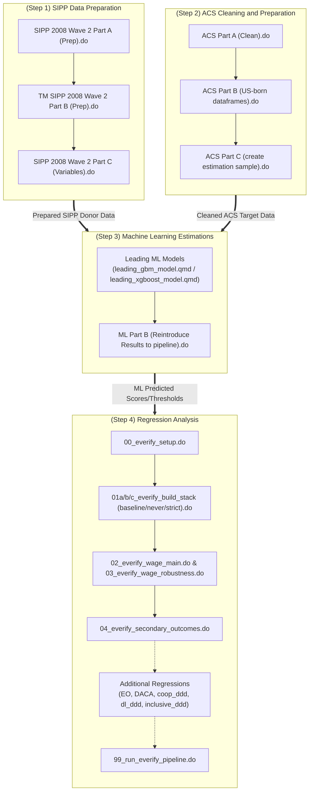

# Pipeline

# ML-Causal-Undocu-Research

**Contributors**:  Dr. Veronica Sovero (MSRIP 2024), Mario Arce Acosta

## Abstract
This study estimates the extent of education-occupation mismatch and the associated wage
penalties for undocumented college graduates. Using data from the American Community Sur-
vey (ACS), we classify workers as vertically mismatched (higher educational attainment than
is typical for the occupation) or horizontally mismatched (field of degree is not typical for the
occupation). Because the ACS does not identify undocumented status, we train a gradient
boosting machine (GBM) model on the Survey of Income and Program Participation (SIPP)
and use predicted probabilities to impute status in the ACS. This approach enables new analy-
ses of labor market outcomes for undocumented college graduates in nationally representative
surveys. Undocumented college graduates have higher rates of both vertical and horizontal
mismatch and face a wage penalty of about 8 percent overall, rising to over 20 percent among
those most likely undocumented. In STEM fields, mismatch differences are small, but a siz-
able wage penalty remains in the high-probability sample, indicating that pay disparities arise
largely within occupations rather than from differences in job placement. Wage and mismatch
penalties are smaller in states with inclusive immigrant policy climates, underscoring the role
of institutional context.

## Data Sources
This research relies on two primary datasets:
1. **Survey of Income and Program Participation (SIPP)**: Acts as the "donor" dataset for our machine learning imputation because it contains direct information on immigration status.
2. **American Community Survey (ACS)**: Acts as the "target" dataset. We impute the undocumented status into this nationally representative dataset to estimate causal labor market penalties.

### Mismatch Definitions
* **Vertical mismatch**: Workers that hold an educational attainment that is not the most common for their occupation (e.g. college graduate as retail worker).
* **Horizontal mismatch**: Worker that holds a degree in a field that is not one of two most common degree fields for an occupation (e.g. engineering major working as an accountant).
* **Horizontal undermatch**: A horizontally mismatched worker whose median wage for their occupation is less than the median wage for workers that are horizontally matched with the same field of study.
* **Horizontal overmatch**: A horizontally mismatched worker whose median wage for their occupation is more than the median wage for workers that are horizontally matched with the same field of study.

### DACA Eligibility Imputation Strategy
A worker is considered DACA-eligible if they are (i) not a citizen and (ii) they meet DACA's age and year of arrival requirements. To distinguish undocumented individuals from other noncitizens with legal status, we filter out individuals with indicators set as true for:
* Receiving social security benefits
* Having veteran status
* Receiving welfare
* Receiving supplementary security income

## Process Overview and Replication Steps
To ensure full reproducibility, the research pipeline is structured into four distinct steps:

**Step 1: SIPP (Survey of Income and Program Participation) Data Preparation**
* *Part A*: Prepare the SIPP core module using the associated DO file.
* *Part B*: Prepare the SIPP topical module (with data on immigration status) using the associated DO file.
* *Part C*: Merge the two module datasets and keep only the variables relevant to the study.

**Step 2: ACS (American Community Survey) Cleaning and Preparing**
* *Part A*: Clean and prepare ACS data by creating all variables except mismatch indicators.
* *Part B*: Create a collapsed table of modal occupations and fields of study, as well as associated median wages.

**Step 3: Machine Learning Estimations**
* *Part A*: Train and evaluate machine learning models on the SIPP data. Impute undocumented status with the best-performing models.
* *Part B*: Reintroduce machine learning imputations of undocumented status into the ACS dataset and create the mismatch indicators.

**Step 4: Regression Analysis**
* Execute the regression models on the fully prepared ACS dataset to evaluate the causal labor market and wage penalties.

<h3>Keywords:</h3>
 Undocumented; Education-occupation mismatch; Legal status; Labor; Wage;
DACA; Income inequality
